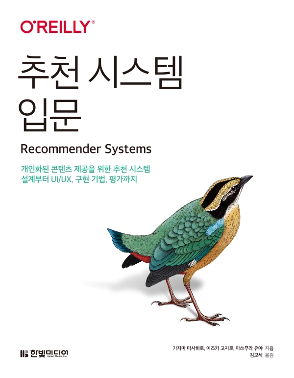

# 추천 시스템 입문

---

---

이 저장소는 한빛미디어에서 발행한 [추천 시스템 입문(Recommender Ssystem)]()의 샘플 코드를 제공하기 위한 저장소입니다.

## 샘플 코드에 관하여

이 책은 독자의 업무를 돕기 위해 쓰여진 책이며 책에서 제공하는 코드의 일부를 사용해 프로그래밍에 활용해도 좋습니다.

블로그에 책으로 공부하신 과정을 남기실 수 있으며 예제도 쓰셔도 됩니다.
다만 저작권 이슈가 있을 수 있으니 요약의 경우 책 내용의 30% 이상이 넘지 않도록 부탁드립니다(비공개 포스팅은 제약이 없습니다).

더불어 <추천 시스템 입문> 도서의 내용을 정리했다는 내용과 함께 출처(책 제목, 한빛미디어 홈페이지 도서 소개 페이지, 표지 이미지)를 표기해 주시면 감사하겠습니다.

### 파일의 구성

|파일명|설명|
|:---|:---|
|`chapter5`|5장에서 사용하는 코드와 데이터[[설명](./chapter5/README.md)]|
|`chapter7`|7장에서 사용하는 코드|

코드 또는 데이터에 관한 설명은 책 본문을 참조하기 바랍니다.

## 정오표

정보표는 아래 URL에서 제공됩니다.

[https://www.hanbit.co.kr/store/books/look.php?p_code=B7471666713](https://www.hanbit.co.kr/store/books/look.php?p_code=B7471666713)
